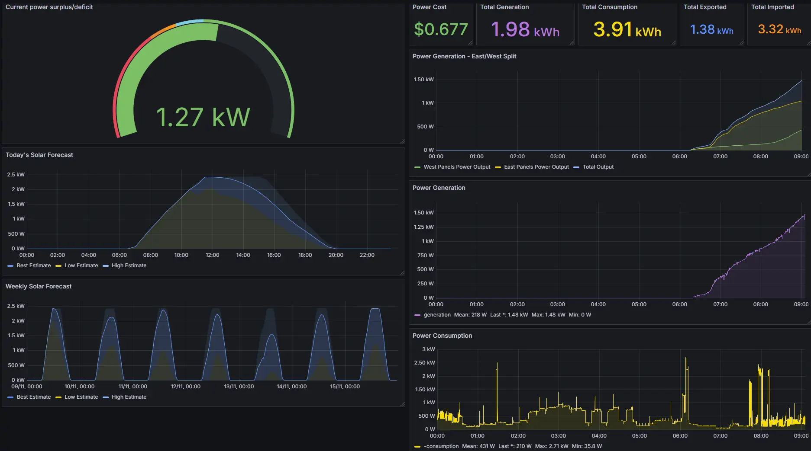

# Solar monitoring app
Monitors solar panel output using the Fronius inverter API and power consumption in realtime and 
persists the data to a MySQL database for display in Grafana.

* Monitors instantaneous power generation and consumption
* Calculate cost of power used
* Monitors per-string power generation
* Retrieves Solcast solar forecasts (https://solcast.com/)
* Uploads actual generation to tune the Solcast forecast

# Usage
Configure solar panel system in Solcast

Setup and run the app:
* Build the application using Maven: `mvn clean package`
* Install and run MySQL (https://www.mysql.com/ or https://mariadb.org/)
* Setup the database using `/solar-sql/src/main/resources/mysql/setup.sql` (substitute your own passwords)
* Add power tariffs (see below for details)
* Configure properties in `application.properties`
  * `app.inverter.host` - hostname/IP of the inverter web API
  * `app.solcast.api-key` - your Solcast API key value
  * `app.solcast.site-id` - your Solcast site ID
  * `spring.datasource.username` - your MySQL app user
  * `spring.datasource.password` - your MySQL app user password
* Run the application

To view the output, use Grafana:
* Install and run Grafana
* Configure the MySQL datasource
* Import the Solar dashboard found in `/solar-core/src/main/resources/grafana/Solar.json`

Sample output:


## Power tariff configuration
There are two types of tariffs:
* **Usage tariffs** - what you are charged for using electricity.
* **Feed-in tariffs** - what you are paid (or possibly charged) for exporting electricity.

### Tariff Data Structure
The application uses the `Tariff` data structure to represent power tariffs. The fields in the `Tariff` class are:

| Field                     | Type         | Description                                                                                     |
|---------------------------|--------------|-------------------------------------------------------------------------------------------------|
| `feedIn`                  | `boolean`    | `true` for a feed-in tariff, `false` for a usage tariff.                                        |
| `startEffectiveDateEpoch` | `long`       | The time when this tariff begins to be effective, in seconds since the epoch or as a date string. |
| `endEffectiveDateEpoch`   | `Long`       | The time when this tariff stops being effective, in seconds since the epoch. Can be `null`.     |
| `dayOfWeek`               | `DayOfWeek`  | The day of the week this tariff applies to (e.g., `SUNDAY`, `MONDAY`).                         |
| `startOfPeriod`           | `LocalTime`  | The time of day when this tariff starts being effective (e.g., `00:00:00`, `15:00:00`).         |
| `endOfPeriod`             | `LocalTime`  | The time of day when this tariff stops being effective (e.g., `10:00:00`, `23:59:59`).          |
| `pricePerKwh`             | `BigDecimal` | The price for one kilowatt-hour (kWh) (e.g., `0.2174`).                                         |

### Loading Tariffs
To load tariffs into the application, follow these steps:

1. **Create a CSV File**:
   Create a CSV file containing the tariff data. The file must include both usage and feed-in tariffs for each day of the week, covering the entire day from `00:00:00` to `23:59:59`.

   Example CSV file:
   ```csv
   feedIn,startEffectiveDateEpoch,endEffectiveDateEpoch,dayOfWeek,startOfPeriod,endOfPeriod,pricePerKwh
   true,2024-11-10 00:00:00,,SUNDAY,00:00:00,23:59:59,0.033
   false,2024-11-10 00:00:00,,SUNDAY,00:00:00,15:00:00,0.2174
   false,2024-11-10 00:00:00,,SUNDAY,15:00:00,21:00:00,0.4082
   false,2024-11-10 00:00:00,,SUNDAY,21:00:00,23:59:59,0.2174
   ```

2. **Configure the Application**:
   Update the `application.properties` file to point to the CSV file:
   ```properties
   app.tariff.file-path=/path/to/tariff-file.csv
   app.tariff.date-format=yyyy-MM-dd HH:mm:ss
   app.tariff.timezone=Australia/Melbourne
   ```

3. **Trigger the Update**:
   Call the `/update-tariffs` endpoint to load the tariffs into the application. This endpoint validates the tariffs and applies them to the database.

### Examples
#### Flat Tariff Example
If you are paid $0.033 per kWh for export, regardless of the time of day, the CSV entry for Sunday would look like:
```csv
true,2024-11-10 00:00:00,,SUNDAY,00:00:00,23:59:59,0.033
```

#### Time-of-Use Tariff Example
If you are charged different amounts depending on the time of day, you will have multiple rows per day. For example:
- $0.2174 between midnight and 3pm,
- $0.4082 between 3pm and 9pm,
- $0.2174 between 9pm and midnight.

The CSV entries for Sunday would look like:
```csv
false,2024-11-10 00:00:00,,SUNDAY,00:00:00,15:00:00,0.2174
false,2024-11-10 00:00:00,,SUNDAY,15:00:00,21:00:00,0.4082
false,2024-11-10 00:00:00,,SUNDAY,21:00:00,23:59:59,0.2174
```
